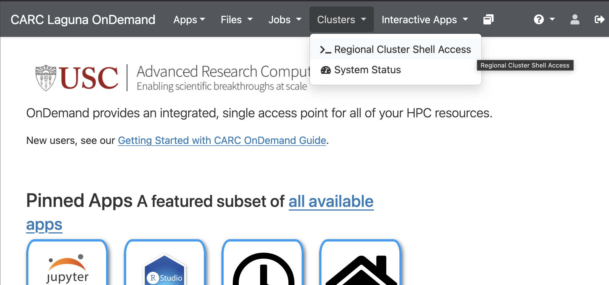
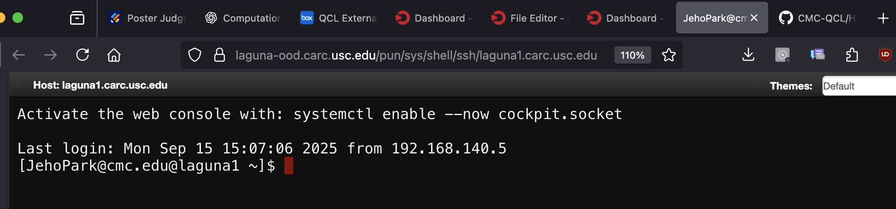

# Laguna SSH Key Issue and Workaround

## Pre-requisite: SSH Key Pair

If you haven’t generated your SSH private key and public key pair,

1. Open Terminal (Mac) or Windows Subsystem for Linux (Windows)
2. Generate an RSA key pair: 

```jsx
ssh-keygen -t rsa -b 4096
```

Just enter-enter-enter to accept the default options. This will generate two files under .ssh folder.

- Private key: id_rsa (this should not be shared with anyone.)
- Public key: id_rsa.pub (this is a public key, i.e., no secret)

1. Open your public key, id_rsa.pub, from ~/.ssh folder and copy all text contents. It should start with “ssh-rsa” followed by a bunch of alphanumeric characters.

## Manually Adding Public SSH Key to Laguna

An alternative is to use Open Ondemand to add their public ssh key to their "home_directory/.ssh/authorized_keys" file:

1. Open OOD ([https://laguna-ood.carc.usc.edu/](https://laguna-ood.carc.usc.edu/))

.png)

1. Click the menu, Files
2. Click Home Directory
    
    .png)
    
3. Check “Show Dotfiles” box
    
    .png)
    

1. Click on .ssh folder
2. Click Edit for authorized_keys

.png)

1. Add public ssh key (id_rsa.pub) to end of the authorized_keys file and save
    
    .png)
    

## SSH to Laguna without Password

Now it’s time to check if you can ssh to the Laguna server without password.

1. Open your terminal (Mac) / Bash for Git or CMD (Windows)
2. Type the following ssh command:
    
    Example of my ssh command:
    
    *$ ssh JehoPark@cmc.edu@laguna.carc.usc.edu*
    
    .png)
    

## Checking Shell Access from OOD

1. Open Laguna OnDemand
2. Click on the meny, Cluster, and then choose >_Regional Cluster Shell Access



1. If the manual SSK key setup went well, you should see the following shell access from your browser.
    
    

We've heard that the browser shell access is not working even after manually adding the SSH public key. Please use your terminal or Git Bash.